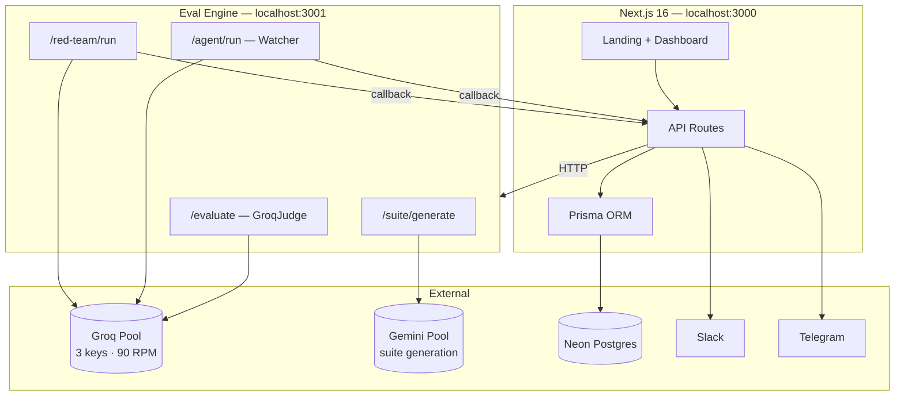

<p align="center">
  
</p>

<h1 align="center">Veridian</h1>

<p align="center">
  <strong>The truth layer for enterprise AI.</strong><br/>
  Catch regressions, hallucinations, and adversarial failures before your users do.
</p>

<p align="center">
  <a href="#features">Features</a> ·
  <a href="#architecture">Architecture</a> ·
  <a href="#quick-start">Quick Start</a> ·
  <a href="#configuration">Configuration</a> ·
  <a href="#how-it-works">How It Works</a>
</p>

<p align="center">
  
  
  
  
  
  
  
</p>

---

## What is Veridian?

**Veridian** is an AI evaluation and regression testing platform. It lets teams define eval suites, run models against them with LLM-as-judge scoring, watch production deployments for quality drops, and run autonomous red-team attacks — all from a single dashboard.

Built for **TechnoTarang 2026** by **Team Cipher**.

| Without Veridian | With Veridian |
|---|---|
| Silent model regressions in production | Continuous automated evaluation |
| User complaints as the alert system | Instant Slack & Telegram alerts |
| No audit trail for AI decisions | Full traceability + PDF compliance reports |
| Manual red-teaming | 6-node LangGraph adversarial pipeline |

---

## Features

### Eval Suites & Runs
- Create **eval suites** with domain-specific test cases (medical triage, BFSI, hiring, and more in the seed data).
- Run any supported **Groq model** or **custom OpenAI-compatible provider** against a suite.
- Score outputs with **GroqJudge** — a custom rubric-based judge (`temperature=0`) across multiple metrics.
- Three eval intensities: `standard`, `rigorous`, and `brutal` (adds consistency checks).
- Per-test-case pass/fail, metric breakdown, severity classification, and latency tracking.

### Quality Dashboard
- Quality trends over time, model comparison charts, and metric-level drill-downs.
- Critical regressions feed and deployment health at a glance.

### Watcher Agent (8-node LangGraph)
Autonomous regression detection when a watched deployment's model changes:

```
trigger_received → load_eval_suite → run_model → score_results
→ compare_baseline → root_cause_analysis → generate_report → notify
```

- Compares new scores against a configurable threshold.
- Performs root-cause analysis on failure clusters.
- Fires **Slack** and **Telegram** notifications with a full agent trace.

### Red Team (6-node LangGraph)
Adversarial testing pipeline that generates attacks, executes them, analyzes vulnerabilities, and produces a report:

```
load_targets → generate_attacks → execute_attacks
→ analyze_vulnerabilities → generate_red_team_report → notify
```

### Watched Deployments
- Tie an eval suite to a deployment with a quality threshold.
- Trigger the watcher agent manually or via integrations.
- Simulate regressions from the UI to validate alerting.

### Integrations
- **Slack** — bot commands, interactive actions, and webhook notifications.
- **Telegram** — webhook-based alerts (`npm run sync-tg` to register).
- **Custom providers** — register any OpenAI-compatible API endpoint.

### Compliance
- Exportable **PDF audit reports** per eval run.
- Judge reasoning stored for every metric — not just scores.
- Designed with **DPDP** (India's Digital Personal Data Protection Act) audit readiness in mind.

---

## Architecture

Veridian is a **two-service monorepo**: a Next.js app (UI + API + database) and a Python eval engine (scoring + agents).



### Agent callback flow

Long-running agents are **async by design** — the web app never blocks on agent completion:

1. `POST /api/deployments/[id]/trigger` → creates `AgentRun` (status: `running`) → fires `POST /agent/run` on the eval engine → returns `202` immediately.
2. Python LangGraph agent runs all nodes autonomously.
3. On completion, engine `POST`s results to `NEXT_PUBLIC_APP_URL/api/agent-runs/[id]/result`.
4. Frontend **polls** `GET /api/agent-runs/[id]` every 2s until `status === "completed"`.

---

## Project Structure

```
Veridian/
├── web/                          # Next.js 16 frontend + API
│   ├── prisma/
│   │   ├── schema.prisma         # Database models
│   │   ├── seed.ts               # Medical + domain test cases
│   │   └── migrations/
│   └── src/
│       ├── app/
│       │   ├── page.tsx          # Marketing landing page
│       │   ├── (dashboard)/      # Dashboard routes
│       │   └── api/              # REST API (33 routes)
│       ├── components/           # UI by feature
│       ├── services/             # Business logic
│       └── hooks/                # TanStack Query hooks
│
└── eval_engine/                  # Python FastAPI + LangGraph
    ├── main.py                   # App entry (port 3001)
    ├── provider_pool.py          # Groq + Gemini key rotation
    ├── metrics/
    │   └── deepeval_runner.py    # Custom GroqJudge (replaces DeepEval)
    ├── agent/                    # 8-node Watcher agent
    │   ├── watcher_agent.py
    │   └── nodes/
    ├── red_team/                 # 6-node Red Team agent
    │   ├── red_team_agent.py
    │   └── nodes/
    └── routers/                  # FastAPI route modules
```

---

## Quick Start

### Prerequisites

| Tool | Version |
|---|---|
| Node.js | 20+ |
| Python | 3.11+ |
| PostgreSQL | Neon (or any Postgres 15+) |
| API keys | Groq (required), Gemini (for suite generation), optional Slack/Telegram |

### 1. Clone the repository

```bash
git clone https://github.com/<your-org>/Veridian.git
cd Veridian
```

### 2. Set up the database

Create a [Neon](https://neon.tech) project (or use local Postgres) and copy the connection strings.

```bash
cd web
cp .env.example .env.local
# Edit .env.local — set DATABASE_URL and DIRECT_URL
npm install
npx prisma migrate deploy
npm run seed          # optional: loads demo medical eval suites
```

### 3. Start the web app

```bash
# from web/
npm run dev
# → http://localhost:3000
```

### 4. Start the eval engine

```bash
cd eval_engine
python -m venv .venv
source .venv/bin/activate       # Windows: .venv\Scripts\activate
pip install -r requirements.txt
cp .env.example .env
# Edit .env — set Groq keys (see Configuration)
python main.py
# → http://localhost:3001
```

Verify both services:

```bash
curl http://localhost:3001/health
# {"status":"ok","providers":{...}}
```

Open **http://localhost:3000** → click **Open Dashboard**.

---

## Configuration

### Web (`web/.env.local`)

| Variable | Required | Description |
|---|---|---|
| `DATABASE_URL` | Yes | Neon pooled connection string |
| `DIRECT_URL` | Yes | Neon direct connection (migrations) |
| `EVAL_ENGINE_URL` | Yes | Eval engine base URL, e.g. `http://localhost:3001` |
| `NEXT_PUBLIC_APP_URL` | Yes | Public app URL for agent callbacks, e.g. `http://localhost:3000` |
| `GROQ_API_KEY_1` | Yes | Groq runner pool key 1 |
| `GROQ_API_KEY_2` | Recommended | Groq runner pool key 2 |
| `GROQ_JUDGE_MODEL` | Yes | Groq API key used for judge/scoring calls |
| `GEMINI_API_KEY_1` | For suite gen | Gemini key for AI test-case generation |
| `GEMINI_API_KEY_2` | Optional | Second Gemini key for rotation |
| `SLACK_BOT_TOKEN` | Optional | Slack bot integration |
| `SLACK_SIGNING_SECRET` | Optional | Slack request verification |
| `TELEGRAM_BOT_TOKEN` | Optional | Telegram alert bot |

### Eval Engine (`eval_engine/.env`)

| Variable | Required | Description |
|---|---|---|
| `GROQ_API_KEY_1` | Yes | Runner pool |
| `GROQ_API_KEY_2` | Recommended | Runner pool |
| `GROQ_JUDGE_MODEL` | Yes | Judge pool (scoring + red team analysis) |
| `GEMINI_API_KEY_1` | For suite gen | Test-case generation |
| `GEMINI_API_KEY_2` | Optional | Gemini rotation |

> **Tip:** Use separate Groq accounts for runner vs. judge keys to maximize effective RPM (~90 RPM across 3 keys).

---

## How It Works

### Evaluation metrics

Each test case is scored by **GroqJudge** (`llama-3.3-70b-versatile`, `temperature=0`) using structured JSON rubrics:

| Metric | What it measures |
|---|---|
| `answer_relevancy` | Does the response address the question? |
| `hallucination` | Does the output contradict or fabricate beyond context? |
| `faithfulness` | Is the output grounded in provided context? |
| `correctness` | Does it match the expected output semantically? |
| `consistency` | *(rigorous/brutal only)* Are repeated runs stable? |

**Pass thresholds:** per-metric ≥ `0.5`, overall test case ≥ `0.75`.

### Supported eval models (Groq)

```
llama-3.1-8b-instant
llama-3.3-70b-versatile
meta-llama/llama-4-scout-17b-16e-instruct
openai/gpt-oss-120b
openai/gpt-oss-20b
qwen/qwen3-32b
… and more (see model.service.ts)
```

Custom providers (OpenAI-compatible) can be registered in **Settings → Providers**.

### Key API routes

<details>
<summary><strong>Web API (Next.js)</strong></summary>

| Route | Method | Purpose |
|---|---|---|
| `/api/suites` | GET, POST | List / create eval suites |
| `/api/suites/[id]` | GET, PUT, DELETE | Suite CRUD |
| `/api/suites/generate` | POST | AI-generate test cases |
| `/api/runs` | GET, POST | List / start eval runs |
| `/api/runs/[id]/report` | GET | Download PDF report |
| `/api/deployments` | GET, POST | Watched deployments |
| `/api/deployments/[id]/trigger` | POST | Trigger watcher agent |
| `/api/agent-runs/[id]` | GET | Poll agent status + trace |
| `/api/red-team-runs` | GET, POST | Red team runs |
| `/api/providers` | GET, POST | Custom model providers |
| `/api/dashboard/*` | GET | Analytics aggregates |

</details>

<details>
<summary><strong>Eval Engine (FastAPI)</strong></summary>

| Route | Method | Purpose |
|---|---|---|
| `/health` | GET | Service + provider pool status |
| `/evaluate` | POST | Score test case outputs |
| `/agent/run` | POST | Start watcher agent (returns 202) |
| `/red-team/run` | POST | Start red team agent (returns 202) |
| `/suite/generate` | POST | Generate adversarial test cases |

</details>

---

## Development

### Web scripts

```bash
cd web
npm run dev          # Start dev server (port 3000)
npm run build        # Production build
npm run lint         # ESLint
npm run seed         # Seed database with demo suites
npm run sync-tg      # Register Telegram webhook
```

### Database

```bash
cd web
npx prisma studio              # Visual DB browser
npx prisma migrate dev           # Create migration after schema change
npx prisma generate            # Regenerate Prisma client
```

### Eval engine

```bash
cd eval_engine
python main.py                 # Dev server with hot reload (port 3001)
```

### Code conventions

See [`AI_RULES.md`](AI_RULES.md) for project-wide patterns:
- Prisma access only via `@/lib/prisma`
- Business logic in `src/services/*.service.ts`
- Zod validation in all API route handlers
- TanStack Query for all frontend data fetching
- LangGraph nodes always append to `agent_trace` and return full state

---

## Screenshots

> Add screenshots of the dashboard, eval run results, agent trace viewer, and red team findings here after your first local run.

| Dashboard | Eval Run Results | Agent Trace |
|:---:|:---:|:---:|
| *coming soon* | *coming soon* | *coming soon* |

---

## Roadmap

- [ ] Multi-tenant workspace support
- [ ] Scheduled eval cron jobs
- [ ] Webhook triggers for CI/CD pipelines
- [ ] Additional judge models (local + cloud)
- [ ] Expanded compliance report templates

---

## Acknowledgments

Built with [Next.js](https://nextjs.org), [FastAPI](https://fastapi.tiangolo.com), [LangGraph](https://langchain-ai.github.io/langgraph/), [Groq](https://groq.com), [Neon](https://neon.tech), [Prisma](https://prisma.io), and [shadcn/ui](https://ui.shadcn.com).

---


